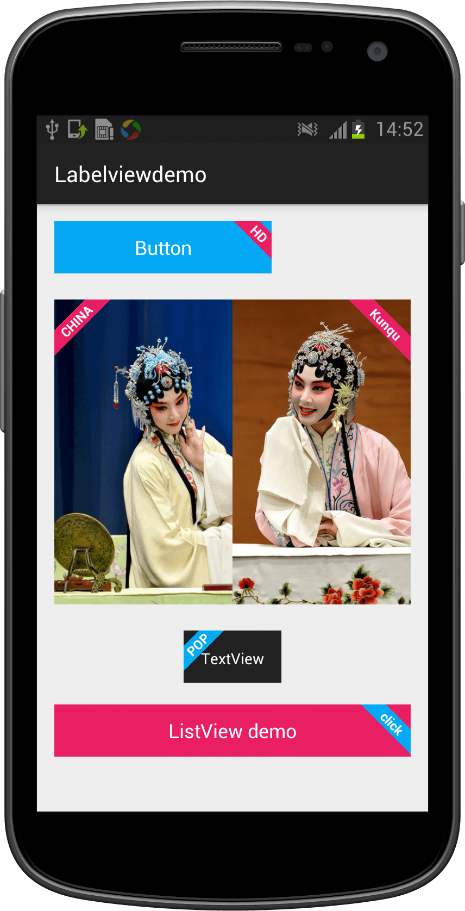
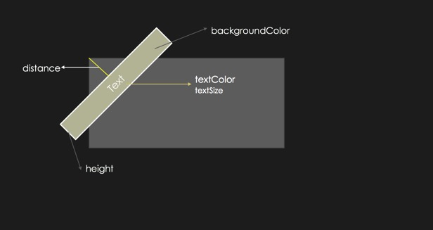

# LabelView
Sometimes, we need to show a label above an ImageView or any other views. Well, LabelView will be able to help you. It's easy to implement as well!



# Import your project

Copy [`LabelView.java`](Labelviewdemo/app/src/main/java/com/lid/labelviewdemo/LabelView.java) into your project.

# Create a Label

LabelView extends from `TextView` so you can treat it as a `TextView` and use any of its method.

Usage:

```
LabelView label = new LabelView(this);
label.setText("POP");
label.setBackgroundColor(0xff03a9f4);
label.setPadding(40,1,40,1);
label.setTargetView(findViewById(R.id.text), 10, LabelView.Gravity.LEFT_TOP);
```
# setTargetView parameters

    setTargetView(findViewById(R.id.text), 10, LabelView.Gravity.LEFT_TOP)

The second parameter states the distance between the edge of the bottom view and LabelView



The third parameter states the side of where LabelView should appear on the bottom view.  (only `LEFT_TOP` and `RIGHT_TOP`)