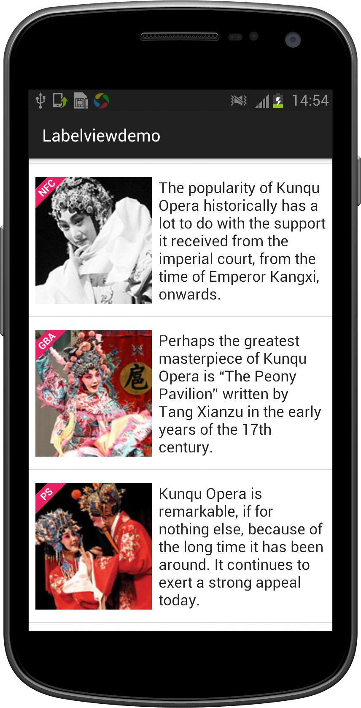

# LabelView

[](https://android-arsenal.com/details/3/1538)

Sometimes, we need to show a label above an ImageView or any other views. Well, LabelView will be able to help you. It's easy to implement as well!





# Import your project

Copy [`LabelView.java`](Labelviewdemo/app/src/main/java/com/lid/labelviewdemo/LabelView.java) into your project.

# Create a Label

LabelView extends from `TextView` so you can treat it as a `TextView` and use any of its method.

Usage:

```
LabelView label = new LabelView(this);
label.setText("POP");
label.setBackgroundColor(0xff03a9f4);
label.setTargetView(findViewById(R.id.text), 10, LabelView.Gravity.LEFT_TOP);
```
# setTargetView parameters

    setTargetView(findViewById(R.id.text), 10, LabelView.Gravity.LEFT_TOP)

+ The second parameter states the distance between the edge of the bottom view and LabelView(unit dip)


+ The third parameter states the side of where LabelView should appear on the bottom view.  (only `LEFT_TOP` and `RIGHT_TOP`)


# remove label

you can use remove method. eg:

```
label.remove();
```


# LabelView in BaseAdpter

if you using LabelView in BaseAdpter and reuse of convertView, you have to generate label ID manual. eg:

```
public View getItemView(int position, View convertView, ViewHolder holder) {

	......
	
    // you have to generate label ID manual
    LabelView label = holder.getView(12345);
    if (label == null) {
        label = new LabelView(this);
        label.setId(12345);
        label.setBackgroundColor(0xffE91E63);
        label.setTargetViewInBaseAdapter(imageView, 138, 10, LabelView.Gravity.LEFT_TOP);
    }
    label.setText(your data);
    return convertView;
}
```

# setTargetViewInBaseAdapter parameters

+ The second parameter means targetView width(unit dip).

# Thanks

+ [shaunidiot](https://github.com/shaunidiot) English ReadMe supported

License
----------

    Copyright 2014 linger1216

    Licensed under the Apache License, Version 2.0 (the "License");
    you may not use this file except in compliance with the License.
    You may obtain a copy of the License at

    http://www.apache.org/licenses/LICENSE-2.0

    Unless required by applicable law or agreed to in writing, software
    distributed under the License is distributed on an "AS IS" BASIS,
    WITHOUT WARRANTIES OR CONDITIONS OF ANY KIND, either express or implied.
    See the License for the specific language governing permissions and
    limitations under the License.

